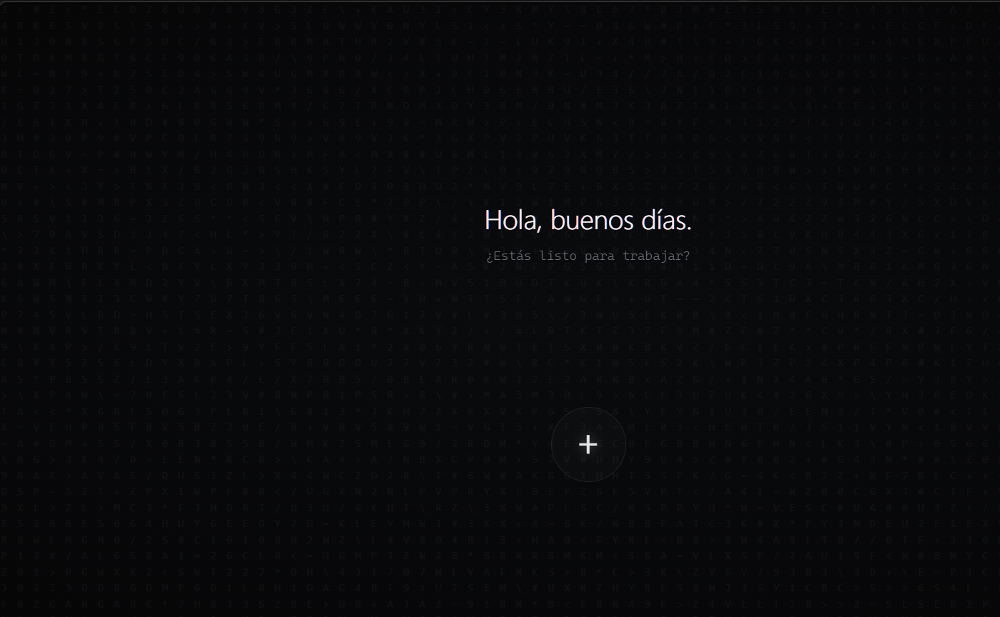

# TEK

**Un navegador de escritorio hecho a mano.** Minimalista, en español, que aprende de ti sin mandar
nada a ningún servidor. Bloquea anuncios, reproduce Netflix, guarda tus contraseñas cifradas y
automatiza lo que haces todos los días.



---

## Descargar

**Windows:** baja el instalador de la
[última versión](https://github.com/Cxly1/TEK/releases/latest) (`TEK-x.y.z-setup.exe`),
doble clic y listo.

> Windows dirá que "no reconoce el editor" porque el instalador no está firmado con un
> certificado de pago. Pulsa **Más información → Ejecutar de todos modos**.

La primera vez TEK te preguntará tu nombre y te dará un tutorial guiado de un minuto: va
señalando cada parte de la interfaz con un foco de luz y te explica para qué sirve. Puedes
repetirlo cuando quieras desde **☰ → Repetir tutorial**.

---

## Qué trae

**Lo básico, pero bien hecho**

- Una sola barra para todo (`Ctrl+K`): busca, navega, y recuerda lo que ya buscaste.
  Atajos: `yt gatos`, `gh react`, `g recetas`.
- Pestañas que **se agrupan solas por sitio**, con color propio, plegables y arrastrables.
- Buscar en la página (`Ctrl+F`), reabrir la que cerraste (`Ctrl+Shift+T`), menús con clic derecho.
- **Lupa**: `Ctrl` + rueda acerca la página sin descuadrar el diseño.
- Descargas con aviso nativo de Windows, historial buscable y borrable.
- Toda la interfaz se recorre **solo con el teclado**.

**Que aprende de ti — y solo para ti**

- El "Cerebro" registra qué abres y a qué hora en una base SQLite **local**, y la pantalla de
  nueva pestaña te pone delante lo que sueles usar en esta franja del día.
- Detecta rutinas ("por las mañanas abres estas tres") y te ofrece abrirlas de golpe.
- Panel **"Lo que TEK sabe de ti"**: puedes ver, olvidar sitio a sitio, pausar el aprendizaje o
  borrarlo todo. Nada sale del equipo.

**Privacidad y seguridad**

- Adblock con el motor de [Ghostery](https://github.com/ghostery/adblocker) (linaje uBlock
  Origin / Brave), *offline-first*: funciona sin red desde el primer arranque.
- Permisos de sitio **denegados por defecto** (cámara, micro, ubicación…) con diálogo propio.
- Gestor de contraseñas con **doble cifrado**: el del propio sistema operativo y, si la
  activas, una **contraseña maestra** que solo tú conoces. En disco jamás hay texto plano, el
  relleno exige un clic tuyo y host exacto, y el aviso solo sale si la página tiene de verdad
  un campo donde escribir.
- Borrado de cookies/caché/almacenamiento, global o por sitio.

**Extras**

- **Mini-player**: manda un vídeo a una miniatura que te sigue mientras navegas, acoplada
  dentro de TEK o como ventana flotante del sistema (`Ctrl+Shift+P`).
- **Netflix, Disney+, Prime Video** funcionan (Widevine vía el runtime de castlabs).
- **Automatización**: recetas (disparador → acciones), workspaces de pestañas, snippets de
  consola, userscripts por sitio, vigías de URL, macros grabadas y un puente HTTP local
  opcional para agentes.
- Radar de servidores de desarrollo: si tienes Vite en `:5173`, la nueva pestaña te lo ofrece.

---

## Atajos

| Atajo | Qué hace |
| --- | --- |
| `Ctrl+K` / `Ctrl+L` | Buscar o ir a una dirección |
| `Ctrl+T` | Nueva pestaña |
| `Ctrl+W` | Cerrar pestaña |
| `Ctrl+Shift+T` | Reabrir la última cerrada |
| `Ctrl+Tab` | Siguiente pestaña (`+Shift` = anterior) |
| `Ctrl+1…9` | Saltar a una pestaña |
| `Ctrl+F` | Buscar en la página |
| `Ctrl+Shift+P` | Mini-player |
| `Ctrl` + rueda | Lupa |
| `Ctrl+0` | Quitar zoom y lupa |
| `F11` / `F12` | Pantalla completa / DevTools |

---

## Dónde vive lo tuyo

Todo en tu carpeta de usuario (`%APPDATA%/tek` en Windows), en texto plano o SQLite, sin cuentas
ni sincronización:

| Archivo | Qué guarda |
| --- | --- |
| `tek-profile.json` | Tu nombre y si ya viste el tutorial |
| `tek-brain.db` | Historial, visitas, rutinas (el "Cerebro") |
| `tek-tabs.json` | La sesión de pestañas para reanudarla |
| `tek-vault.json` | Contraseñas, **cifradas** (nunca en texto plano) |
| `tek-downloads.json` | Historial de descargas |
| `favicons.json` | Iconos de los sitios, cacheados |

Borrar la carpeta = TEK vuelve a ser nuevo.

---

## Desarrollo

Requisitos: **Node 20+** y **pnpm**.

```bash
git clone https://github.com/Cxly1/TEK.git
cd TEK
pnpm install
pnpm run rebuild   # compila better-sqlite3 para el ABI de Electron
pnpm dev
```

Otros comandos:

```bash
pnpm typecheck     # TypeScript, main + renderer
pnpm build         # empaqueta a out/
pnpm dist          # instalador de Windows en release/
```

**Si TEK "se ve vacío"** (sin sugerencias, panel a cero): es `better-sqlite3` compilado para
Node en vez de para Electron. Cierra TEK y ejecuta `pnpm run rebuild`. Para comprobarlo:

```powershell
$env:ELECTRON_RUN_AS_NODE=1; npx electron -e "require('better-sqlite3'); console.log(process.versions.modules)"
```

Debe imprimir el `NODE_MODULE_VERSION` de Electron (136 en la 37.x).

### Cómo está montado

```
src/
  main/        proceso principal: pestañas (WebContentsView), cerebro, adblock,
               descargas, permisos, contraseñas, automatización
  preload/     puente seguro (contextBridge) + preload que corre en cada web
  renderer/    la interfaz en React: barra, lienzo de nueva pestaña, paneles,
               paleta ⌘K, tutorial guiado
  shared/      contrato IPC único y tipado, compartido por los tres lados
```

Regla del proyecto: **ningún canal IPC con strings sueltos** — todos viven en
`src/shared/ipc.ts` con su payload tipado.

### DRM (Netflix y compañía)

TEK corre sobre [`castlabs/electron-releases`](https://github.com/castlabs/electron-releases),
un fork de Electron con Widevine. Para que el vídeo protegido funcione en un build empaquetado
hay que **firmar el paquete con VMP** (herramienta `castlabs-evs`, cuenta gratuita). Sin firmar,
el navegador funciona igual pero el vídeo con DRM se queda en negro.

El techo es **Widevine L3 → 720p**. El 4K exige DRM por hardware (L1), que ningún navegador de
terceros puede dar.

---

## Licencia

MIT — ver [LICENSE](LICENSE). Úsalo, cámbialo, publícalo.
